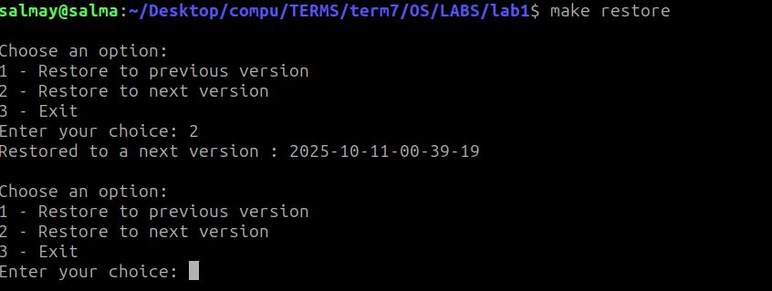
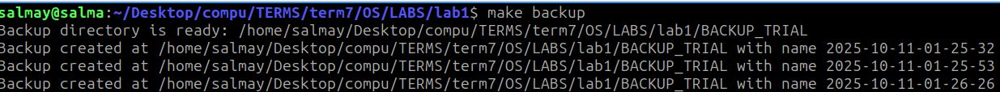

# Lab 2 – Automated Backup & Restore Scripts

## Project Overview

This lab assignment focuses on creating **backup and restore scripts** using Bash. The main goals are:

* Automatically back up a directory.
* Restore a directory to a previous or recent state.
* Manage multiple backups and limit the number of stored backups.

Initially, the scripts were designed to run manually using Bash. Later, the project was extended to use **cron** for **automatic periodic execution**, allowing backups to run **without keeping a terminal open**, simulating real-world scheduled maintenance.

---

## Directory Structure

```text
lab1/
├── .github/
├── tests/
├── SCR_TRIAL/                 # Source files for manual testing
├── BACKUP_TRIAL/              # Backup storage folder for manual testing
├── SRC_TRIAL_CRON/            # Source directory for cron backup
├── BACKUP_TRIAL_CRON/         # Destination for cron backups
├── backupd.sh                 # Manual backup script
├── restore.sh                 # Restore script
├── backupd-cron.sh            # Backup script for cron
├── Makefile                   # Simple Makefile to run scripts
├── directory-info.last
├── directory-info.new
└── README.md
```

---

## Part 1: Backup Script (`backupd.sh`)

**Usage:**

```bash
./backupd.sh <source_dir> <backup_dir> <interval_secs> <max_backups>
```

**Parameters:**

* `source_dir` – Directory to back up
* `backup_dir` – Backup destination
* `interval_secs` – Interval between checks (seconds)
* `max_backups` – Maximum number of backups to retain

**Algorithm:**

1. Generate initial snapshot of the directory:

```bash
ls -lR <source_dir> > directory-info.last
```

2. Copy the source directory to:

```
backup_dir/YYYY-MM-DD-hh-mm-ss
```

3. Loop indefinitely:

* Sleep for `interval_secs`.
* Generate a new snapshot:

```bash
ls -lR <source_dir> > directory-info.new
```

* If snapshots differ, create a new backup and update `directory-info.last`.
* Keep only the most recent `max_backups` directories; delete older ones.

---

## Part 2: Restore Script (`restore.sh`)

**Usage:**

```bash
./restore.sh <source_dir> <backup_dir>
```

**User Options:**

| Input | Action                  |
| ----- | ----------------------- |
| 1     | Restore previous backup |
| 2     | Restore next backup     |
| 3     | Exit restore script     |

**Logging Messages:**

* Next version restored: `"Restored to a next version : $backup_timestamp"`
* Previous version restored: `"Restored to a previous version : $backup_timestamp"`
* No older version: `"No older backup available to restore."`
* No newer version: `"No newer backup available to restore."`

---

## Part 3: Makefile

| Make Command       | Description                                                                   |
| ------------------ | ----------------------------------------------------------------------------- |
| `make backup`      | Run the manual backup script (`backupd.sh`) for the source directory.         |
| `make restore`     | Run the restore script (`restore.sh`) to restore a previous or recent backup. |
| `make cron-backup` | Run the cron backup script (`backupd-cron.sh`) to execute one backup.         |
| `make cron-remove` | Stop any running cron backup process safely.                                  |

---

## Part 4: Cron Job Backup (`backupd-cron.sh`)

**Purpose:** Run automated backups periodically without keeping a terminal open.

**Setup Cron Job:**

1. Ensure cron service is running:

```bash
sudo systemctl start cron
sudo systemctl enable cron
```

2. Edit your crontab:

```bash
crontab -e
```

3. Select editor (if first time, nano is easiest):

```
1. /bin/nano        <---- easiest
```

4. Add a cron entry to run **every 1 minute at 23 seconds**:

```cron
* * * * * sleep 23; /home/salmay/Desktop/compu/TERMS/term7/OS/LABS/lab1/backupd-cron.sh "/home/salmay/Desktop/compu/TERMS/term7/OS/LABS/lab1/SRC_TRIAL_CRON" "/home/salmay/Desktop/compu/TERMS/term7/OS/LABS/lab1/BACKUP_TRIAL_CRON" 3 >> /home/salmay/Desktop/compu/TERMS/term7/OS/LABS/lab1/backup_cron.log 2>&1
```

5. Make your cron script executable:

```bash
chmod +x backupd-cron.sh
```

6. Check installed cron jobs:

```bash
crontab -l
```

---

## Prerequisites

* Ubuntu or Linux OS
* Bash shell
* `rsync` installed:

```bash
sudo apt update
sudo apt install rsync
```

* Cron service installed and active:

```bash
sudo apt install cron
sudo systemctl enable --now cron
```

* Use **full paths** in scripts when running with cron.

---

## How to Run

**Maximum backups = 3**

**Manual backup:**

```bash
./backupd.sh SRC_TRIAL BACKUP_TRIAL 5 3
```

**Restore:**

```bash
./restore.sh SRC_TRIAL BACKUP_TRIAL
```

Then input choices to select:

| Input | Action                  |
| ----- | ----------------------- |
| 1     | Restore previous backup |
| 2     | Restore next backup     |
| 3     | Exit restore script     |

---

## How to Run Cron Backup

1. Start cron service (if not running):

```bash
sudo systemctl start cron
sudo systemctl enable cron
```

2. Make sure your `backupd-cron.sh` is executable:

```bash
chmod +x backupd-cron.sh
```

3. Add cron entry (`crontab -e`) as above.

```cron
* * * * * sleep 23; /home/salmay/Desktop/compu/TERMS/term7/OS/LABS/lab1/backupd-cron.sh "/home/salmay/Desktop/compu/TERMS/term7/OS/LABS/lab1/SRC_TRIAL_CRON" "/home/salmay/Desktop/compu/TERMS/term7/OS/LABS/lab1/BACKUP_TRIAL_CRON" 3 >> /home/salmay/Desktop/compu/TERMS/term7/OS/LABS/lab1/backup_cron.log 2>&1
```

---

## Part 5: Cron Backup – Fixed time 

If you want the backup to run **every 3rd Friday of the month at 12:31 AM**, you can use the following cron expression:

```cron
31 0 15-21 * 5 /home/salmay/Desktop/compu/TERMS/term7/OS/LABS/lab1/backupd-cron.sh >> /home/salmay/Desktop/compu/TERMS/term7/OS/LABS/lab1/backup_cron.log 2>&1
```

## Part 6: Sample Run





