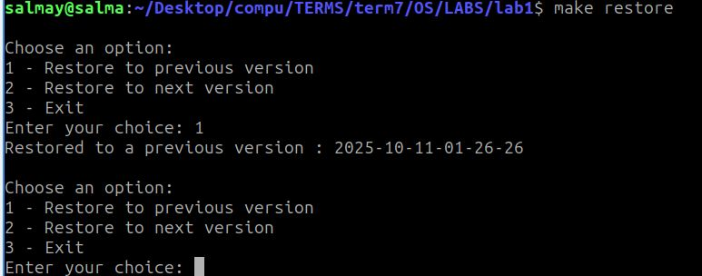

# Assignment 1 – Backup & Restore Scripts

## Project Overview

This lab assignment focuses on creating **backup and restore scripts** using Bash. The main goals are:

* Automatically back up a directory.
* Restore a directory to a previous or recent state.
* Manage multiple backups and limit the number of stored backups.

Initially, the scripts were designed to run manually using Bash. Later, the project was extended to use **cron** for **automatic periodic execution**, allowing backups to run **without keeping a terminal open**, simulating real-world scheduled maintenance.

---

## Directory Structure

```text
OS-Assignment-1-Backup-and-Restore/
├── README.md
│
├── src/
│   ├── backupd.sh                 # Manual backup script
│   ├── restore.sh                 # Restore script
│   ├── backupd-cron.sh            # Backup script for cron
│   └── Makefile                   # Simple Makefile to run scripts
│
├── examples/
│   ├── SRC_TRIAL/                 # Source files for manual testing
│   ├── BACKUP_TRIAL/              # Backup storage folder for manual testing
│   ├── SRC_TRIAL_CRON/            # Source directory for cron backup
│   ├── BACKUP_TRIAL_CRON/         # Destination for cron backups
│   └── tests/
│
├── images/
│   ├── screen1.jpg
│   ├── screen2.jpg
│   └── screen3.jpg
│
└── data/
    ├── directory-info.last        # State file for directory snapshots
    └── directory-info.new
````

-----

## Part 1: Backup Script (`src/backupd.sh`)

**Usage:**

```bash
./src/backupd.sh <source_dir> <backup_dir> <interval_secs> <max_backups>
```

**Parameters:**

  * `source_dir` – Directory to back up (e.g., `examples/SRC_TRIAL`)
  * `backup_dir` – Backup destination (e.g., `examples/BACKUP_TRIAL`)
  * `interval_secs` – Interval between checks (seconds)
  * `max_backups` – Maximum number of backups to retain

**Algorithm:**

1.  Generate initial snapshot of the directory:

<!-- end list -->

```bash
ls -lR <source_dir> > data/directory-info.last
```

2.  Copy the source directory to:

<!-- end list -->

```
backup_dir/YYYY-MM-DD-hh-mm-ss
```

3.  Loop indefinitely:

<!-- end list -->

  * Sleep for `interval_secs`.
  * Generate a new snapshot:

<!-- end list -->

```bash
ls -lR <source_dir> > data/directory-info.new
```

  * If snapshots differ, create a new backup and update `data/directory-info.last`.
  * Keep only the most recent `max_backups` directories; delete older ones.

-----

## Part 2: Restore Script (`src/restore.sh`)

**Usage:**

```bash
./src/restore.sh <source_dir> <backup_dir>
```

**User Options:**

| Input | Action                  |
| ----- | ----------------------- |
| 1     | Restore previous backup |
| 2     | Restore next backup     |
| 3     | Exit restore script     |

**Logging Messages:**

  * Next version restored: `"Restored to a next version : $backup_timestamp"`
  * Previous version restored: `"Restored to a previous version : $backup_timestamp"`
  * No older version: `"No older backup available to restore."`
  * No newer version: `"No newer backup available to restore."`

-----

## Part 3: Makefile

*Note: Since the Makefile is located in the `src` directory, navigate there first or use `make -C src`.*

```bash
cd src
```

| Make Command       | Description                                                                   |
| ------------------ | ----------------------------------------------------------------------------- |
| `make backup`      | Run the manual backup script (`backupd.sh`) for the source directory.         |
| `make restore`     | Run the restore script (`restore.sh`) to restore a previous or recent backup. |
| `make cron-backup` | Run the cron backup script (`backupd-cron.sh`) to execute one backup.         |
| `make cron-remove` | Stop any running cron backup process safely.                                  |

-----

## Part 4: Cron Job Backup (`src/backupd-cron.sh`)

**Purpose:** Run automated backups periodically without keeping a terminal open.

**Setup Cron Job:**

1.  Ensure cron service is running:

<!-- end list -->

```bash
sudo systemctl start cron
sudo systemctl enable cron
```

2.  Edit your crontab:

<!-- end list -->

```bash
crontab -e
```

3.  Select editor (if first time, nano is easiest):

<!-- end list -->

```
1. /bin/nano        <---- easiest
```

4.  Add a cron entry to run **every 1 minute at 23 seconds**:
    *(Note: Update paths to point to your new `src` and `examples` folders)*

<!-- end list -->

```cron
* * * * * sleep 23; /home/salmay/Desktop/.../OS-Assignment-1/src/backupd-cron.sh "/home/salmay/Desktop/.../OS-Assignment-1/examples/SRC_TRIAL_CRON" "/home/salmay/Desktop/.../OS-Assignment-1/examples/BACKUP_TRIAL_CRON" 3 >> /home/salmay/Desktop/.../OS-Assignment-1/backup_cron.log 2>&1
```

5.  Make your cron script executable:

<!-- end list -->

```bash
chmod +x src/backupd-cron.sh
```

6.  Check installed cron jobs:

<!-- end list -->

```bash
crontab -l
```

-----

## Prerequisites

  * Ubuntu or Linux OS
  * Bash shell
  * `rsync` installed:

<!-- end list -->

```bash
sudo apt update
sudo apt install rsync
```

  * Cron service installed and active:

<!-- end list -->

```bash
sudo apt install cron
sudo systemctl enable --now cron
```

  * Use **full paths** in scripts when running with cron.

-----

## How to Run

**Maximum backups = 3**

**Manual backup:**

```bash
./src/backupd.sh examples/SRC_TRIAL examples/BACKUP_TRIAL 5 3
```

**Restore:**

```bash
./src/restore.sh examples/SRC_TRIAL examples/BACKUP_TRIAL
```

Then input choices to select:

| Input | Action                  |
| ----- | ----------------------- |
| 1     | Restore previous backup |
| 2     | Restore next backup     |
| 3     | Exit restore script     |

-----

## How to Run Cron Backup

1.  Start cron service (if not running):

<!-- end list -->

```bash
sudo systemctl start cron
sudo systemctl enable cron
```

2.  Make sure your `backupd-cron.sh` is executable:

<!-- end list -->

```bash
chmod +x src/backupd-cron.sh
```

3.  Add cron entry (`crontab -e`) as above.

<!-- end list -->

```cron
* * * * * sleep 23; /path/to/OS-Assignment-1/src/backupd-cron.sh "/path/to/OS-Assignment-1/examples/SRC_TRIAL_CRON" "/path/to/OS-Assignment-1/examples/BACKUP_TRIAL_CRON" 3 >> /path/to/OS-Assignment-1/backup_cron.log 2>&1
```

-----

## Part 5: Sample Run

```
```



